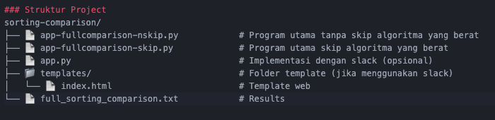

# algoritma-shorting-comparison

# 🔍 Perbandingan Algoritma Sorting

## 📊 Deskripsi Project
Project ini merupakan implementasi dan perbandingan kinerja berbagai algoritma sorting yang dikembangkan dalam Python tanpa menggunakan library sorting bawaan. Tujuannya adalah untuk menganalisis perbedaan performa antar algoritma pada berbagai ukuran dataset.

## 🎯 Tujuan
- Membandingkan performa algoritma sorting Selection Sort, Bubble Sort, Quick Sort, Merge Sort, dan Heap Sort
- Menganalisis dampak kompleksitas waktu terhadap kinerja aktual
- Menyediakan tools testing yang komprehensif untuk edukasi algoritma

## 📈 Algoritma yang Diimplementasikan

### 1. Selection Sort
- **Kompleksitas**: O(n²)
- **Tipe**: Comparison-based
- **Stabil**: Tidak
- **Ruang**: O(1)

### 2. Bubble Sort
- **Kompleksitas**: O(n²)
- **Tipe**: Comparison-based  
- **Stabil**: Ya
- **Ruang**: O(1)

### 3. Quick Sort
- **Kompleksitas**: O(n log n) rata-rata
- **Tipe**: Divide and conquer
- **Stabil**: Tidak
- **Ruang**: O(log n)

### 4. Merge Sort
- **Kompleksitas**: O(n log n)
- **Tipe**: Divide and conquer
- **Stabil**: Ya
- **Ruang**: O(n)

### 5. Heap Sort
- **Kompleksitas**: O(n log n)
- **Tipe**: Comparison-based
- **Stabil**: Tidak
- **Ruang**: O(1)

## 🚀 Fitur Utama

### ✅ Testing Komprehensif
- Semua algoritma dijalankan tanpa skip
- Support dataset besar hingga 50.000 elemen
- Validasi kebenaran hasil sorting

### 📊 Analisis Performa
- Pengukuran waktu eksekusi real-time
- Perhitungan rasio kecepatan antar algoritma
- Progress indicator untuk algoritma lambat

### 💾 Export Hasil
- Generate laporan lengkap dalam format text
- Tabel perbandingan yang informatif
- Timestamp dan metadata testing

## 🛠️ Instalasi dan Penggunaan

### Prerequisites
- Python 3.6 atau lebih tinggi
- Tidak perlu install library tambahan

### Langkah Menjalankan

1. **Download semua file project**
2. **Buka terminal/command prompt**
3. **Jalankan program utama**:

tanpa skip algoritma yang berat
```bash
python3 app-fullcomparison-noskip.py
```
lebih cepat, skip algirtama yang berat
```bash
python3 app-fullcomparison-kip.py
```
### Struktur Project

